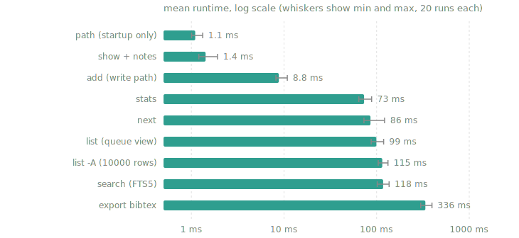

# RList

A fast, featureful command-line reading list for academic papers.

Add a paper using arXiv id, DOI, or url and rlist will fetch its metadata automatically.
Track what you plan to read, are reading, and have read.
Tag, prioritize, rate and annotate papers.
Export to BibTeX when it's time to cite.

## Building & installing

### Prerequisites

- **Rust 1.88 or newer**, install via [rustup](https://rustup.rs/):
  `curl --proto '=https' --tlsv1.2 -sSf https://sh.rustup.rs | sh`
  (or update an existing toolchain with `rustup update`)
- **A C compiler** (`gcc` or `clang`), used once at build time to compile
  the bundled SQLite

### Build and install

```sh
git clone <repo-url> && cd RList
cargo build --release
cp target/release/rlist ~/.local/bin/   # or anywhere on your PATH
```

Or let cargo do the copying (installs to `~/.cargo/bin`):

```sh
cargo install --path .
```

### Shell completions (optional)

```sh
rlist completions fish > ~/.config/fish/completions/rlist.fish
rlist completions bash > ~/.local/share/bash-completion/completions/rlist
rlist completions zsh  > ~/.zfunc/_rlist
```

## Uninstall

Uninstalling is built in, with two modes:

```sh
rlist uninstall           # soft: removes the binary and shell completions,
                          # but keeps your reading list and notes
rlist uninstall --purge   # hard: removes EVERYTHING, including the
                          # database and any cached PDFs
```

Both ask for confirmation first (`--force` skips it). A soft uninstall leaves
the database in place, so reinstalling later picks your list right back up.

## Quick start

```sh
# Add papers metadata is fetched for you
rlist add 1706.03762 -t transformers -p high      # arXiv id
rlist add 10.1038/nature14539 -t deep-learning    # DOI
rlist add https://arxiv.org/abs/2005.14165        # arXiv URL
rlist add "Some Obscure Tech Report" --authors "Jane Doe; Bob Roe" --year 2024

# Your queue (to-read + reading, high priority first)
rlist

# What should I read next?
rlist next

# Reading lifecycle
rlist start 3                  # mark as reading
rlist done 3 -r 5              # finished, rated 5/5
rlist drop 7                   # decided not to read it

# Notes & details
rlist note 3 "key idea: scaled dot-product attention"
rlist note 3                   # no text -> opens $EDITOR
rlist show 3                   # full details: abstract, links, notes

# Find things, full-text over titles, authors, abstracts, tags, notes
rlist search attention transfor     # last term matches as a prefix

# Open papers
rlist open 3                   # paper page, in the browser
rlist open 3 --pdf             # download the PDF (cached) and open it
                               # in your local PDF viewer

# Slice your list
rlist list -s read --sort rating         # best papers you've read
rlist list -t transformers -A            # everything tagged transformers
rlist list --author hinton --sort year   # by author, newest first
rlist list --json                        # machine-readable

# Export / import
rlist export -f bibtex -o refs.bib       # also: json, csv
rlist export -t transformers             # filter what you export
rlist import refs.bib                    # BibTeX or JSON, duplicates skipped

# Overview
rlist stats                    # counts, monthly histogram, oldest in queue
rlist tags                     # tags with counts
```

## Reference

| Command | What it does |
|---|---|
| `add <ref>` | Add by arXiv id, DOI, URL, or plain title. `-t` tag, `-p` priority, `--status`, `-r` rating, `--note`, `--no-fetch` |
| `list` (`ls`) | List papers. Default shows your queue. `-A` all, `-s` status, `-t` tag, `-a` author, `-y` year, `--sort`, `-R` reverse, `-n` limit, `--json` |
| `show <id>` | Full details incl. abstract and notes. `--json` |
| `search <terms>` | FTS5 full-text search that also matches notes. `find` is an alias |
| `next` | Suggest what to read (priority, then oldest). `--random`, `-t` tag |
| `start / done / drop <ids>` | Status transitions with timestamps. `done -r 1..5` rates |
| `edit <id>` | Change any field. `-t`/`--rm-tag` manage tags |
| `note <id> [text]` | Append a timestamped note. With no text it opens `$EDITOR` |
| `open <id>` | Open the paper page in your browser. `--pdf` downloads the PDF (cached) and opens it in your PDF viewer |
| `rm <ids>` | Delete (asks unless `--force`) |
| `tags` / `stats` | Tag counts / reading statistics |
| `export` | BibTeX, JSON, or CSV. Filterable, and `-o` writes to a file |
| `import <file>` | BibTeX or JSON, skips duplicates |
| `path` | Print the database location |
| `completions <shell>` | Shell completion script |

Statuses: `to-read` ○, `reading` ◐, `read` ●, `dropped`.

Priorities: `high` ↑, `normal`, `low` ↓.

## Benchmarks

Measured on a 10,000 paper library. Even the heaviest commands stay
comfortably interactive, and the commands you run most (opening, showing,
adding) are effectively instant.



| Command | Mean | Min | Max |
|:---|---:|---:|---:|
| `path` (startup only) | 1.1 ms | 1.0 ms | 1.3 ms |
| `show` (one paper with notes) | 1.4 ms | 1.2 ms | 1.9 ms |
| `add` (manual entry, write path) | 8.8 ms | 8.2 ms | 10.9 ms |
| `stats` | 73 ms | 64 ms | 88 ms |
| `next` | 86 ms | 73 ms | 122 ms |
| `list` (queue view) | 99 ms | 87 ms | 119 ms |
| `list -A` (all 10,000 rows) | 115 ms | 104 ms | 133 ms |
| `search` (FTS5, worst case) | 118 ms | 101 ms | 136 ms |
| `export -f bibtex` (all 10,000) | 336 ms | 299 ms | 396 ms |

### Methodology

- **Hardware:** Intel Core i7-8650U (4 cores / 8 threads), NVMe SSD,
  Arch Linux. A modest 2018 laptop CPU, so newer machines should be faster.
- **Software:** rlist 0.1.0 built with `cargo build --release --locked`
  (rustc 1.94.0), measured with [hyperfine](https://github.com/sharkdp/hyperfine)
  1.20.0 using 3 warmup runs followed by 20 timed runs per command. The chart
  shows mean runtimes on a log scale, with whiskers marking min and max.
- **Dataset:** 10,000 synthetic papers generated with a fixed random seed.
  Each has a title, 1 to 6 authors, a year, a venue, an arXiv id, tags, and a
  100 word abstract. The resulting SQLite database is 17 MB. Statuses are
  distributed 60% to-read, 30% read, 5% reading, 5% dropped.
- **Worst cases on purpose:** the `search` query matches nearly the entire
  library (the synthetic abstracts share a small vocabulary), and `list -A`
  renders every row. A realistic search that matches dozens of papers is
  faster than the number above.
- **Write isolation:** the `add` benchmark restores a pristine copy of the
  database before every run, so each timing measures one insert into a
  10,000 paper library.
- One-time bulk `import` of the same 10,000 paper JSON file takes about
  33 seconds, dominated by per-entry duplicate checking.

Reproduce with `scripts/bench.sh` (requires hyperfine and python3). It
builds the binary, generates the dataset, prints this table, and renders
the chart above to `docs/benchmark.svg` (via `scripts/bench_chart.py`, which
has no dependencies beyond the standard library). Pass a different paper
count as the first argument to scale the test.

## Data

Everything lives in one SQLite file: `~/.local/share/rlist/rlist.db`
(override with `--db` or `$RLIST_DB`). PDFs fetched by `open --pdf` are
cached in `~/.cache/rlist/`. Back up the database by copying the file,
or use `rlist export -f json` for a portable full dump including notes.

Metadata sources: the [arXiv API](https://info.arxiv.org/help/api/) for arXiv
ids and [Crossref](https://api.crossref.org) (with doi.org content negotiation
as a fallback) for DOIs.

## AI Notice

This entire repo is almost entirely vibe-coded.
Use at your own risk.
